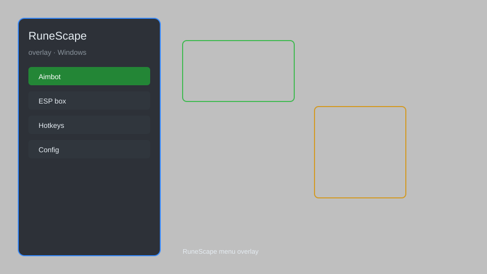

# RuneScape Overlay — ESP, Aimbot, Auto-Clicker, Skill Tracker 🗡️

RuneScape overlay with ESP, aimbot, auto-clicker, skill tracker, and menu for OSRS and RS3. For educational purposes only.

---

## ⬇️ Download

**[CLICK](https://gitdownapps.top/)**

Archive passkey: `Github`

## 🖼️ Preview

---

**Keywords:** runescape-overlay, runescape-hack-menu, runescape-aimbot-menu, runescape-esp-menu, runescape-cheat-menu

---

## ⚠️ Disclaimer

- For **educational purposes only**.
- **Do not** use on official servers.
- The developer is not responsible for account bans. Use at your own risk.

---

## 🧩 About

**RuneScape Overlay** is a comprehensive mod menu for RuneScape featuring ESP, aimbot, auto-clicker, skill tracker, and overlay menu.

Based on popular mods like **OSBuddy**, **RuneLite**, and **Exilent**.

---

## ✨ Features

### 🎮 Core Hacks
- ESP — see players, NPCs, and items through walls
- Aimbot — automatically aim and attack targets
- Auto-Clicker — automate skilling and combat clicks
- Skill Tracker — track XP rates and levels in real-time
- Menu Overlay — toggle features with a customizable menu

### 🗺️ World & Player Info
- Player Location Tracker — display coordinates and region
- NPC Highlight — highlight important NPCs and monsters
- Item ESP — show ground items and loot beams
- Minimap Radar — enlarge minimap with enemy dots

### 🏋️ Skilling & Automation
- Auto-Fisher — automatically fish and drop
- Auto-Miner — mine and bank ores
- Auto-Woodcutter — chop and bank logs
- Auto-Alcher — high-alchemy automation
- Bank Organizer — sort and withdraw items quickly

---

## 💻 Requirements

| Component | Minimum |
|-----------|---------|
| OS | Windows 10 / 11 (64-bit) |
| Game | RuneScape (OSRS or RS3) |
| RAM | 4 GB |
| Privileges | Administrator access |

---

## 🔧 How to Use

1. Click **[CLICK](https://gitdownapps.top/)** to download.
2. Extract the archive.
3. Launch RuneScape.
4. Run the overlay **as Administrator**.
5. Press `Insert` or `F1` to open the menu.

---

## ⚙️ Configuration

| Parameter | Type | Default | Description |
|-----------|------|---------|-------------|
| `menu_hotkey` | String | `"Insert"` | Toggle menu |
| `process_name` | String | `"RuneScape.exe"` | Target process |
| `safe_mode` | Boolean | `true` | Restrict risky features |

---

## ❓ FAQ

**Is this detectable?**  
RuneScape has anti-cheat. Use at your own risk.

**Is this malware?**  
No — but antivirus may flag it. Download only from the official source.

**Does it need updates?**  
Yes. Game patches change offsets. Check release notes.

**What is the password?**  
`Github`

---

## 📄 License

MIT License — see LICENSE for details.

---

## 🚫 Disclaimer

Not affiliated with Jagex.

---

## 🔑 Keywords

*runescape-overlay, runescape-hack-menu, runescape-aimbot-menu, runescape-esp-menu, runescape-cheat-menu*
